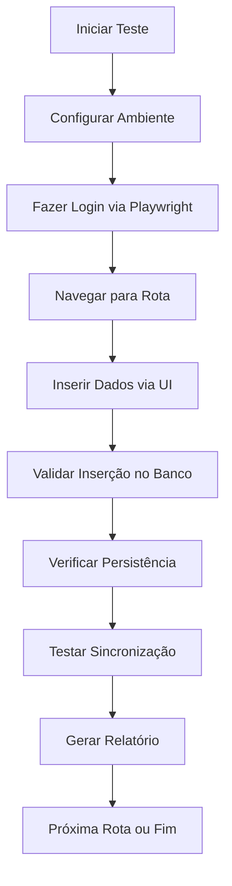

# Design Document

## Overview

Este documento descreve o design para implementar testes automatizados de conectividade e persistência de dados para a aplicação StayFocus. O sistema utilizará as ferramentas Supabase MCP e Playwright Automation para validar a integração entre o frontend Next.js e o banco de dados Supabase, garantindo que todas as funcionalidades de inserção, persistência e sincronização de dados funcionem corretamente.

## Architecture

### Componentes Principais

1. **Test Orchestrator**: Coordena a execução dos testes e gera relatórios
2. **Database Validator**: Utiliza Supabase MCP para validar dados no banco
3. **UI Automation**: Utiliza Playwright para interagir com a interface
4. **Data Generator**: Gera dados de teste válidos para cada módulo
5. **Report Generator**: Compila resultados e gera relatórios detalhados

### Fluxo de Teste



## Components and Interfaces

### 1. Test Configuration

```typescript
interface TestConfig {
  baseUrl: string
  credentials: {
    email: string
    password: string
  }
  routes: RouteConfig[]
  timeout: number
}

interface RouteConfig {
  path: string
  name: string
  testData: any
  validationQueries: string[]
}
```

### 2. Test Result Structure

```typescript
interface TestResult {
  route: string
  timestamp: string
  connectivity: ConnectivityResult
  insertion: InsertionResult
  persistence: PersistenceResult
  synchronization: SyncResult
  errors: TestError[]
}

interface ConnectivityResult {
  success: boolean
  responseTime: number
  statusCode?: number
}

interface InsertionResult {
  success: boolean
  dataInserted: boolean
  validationPassed: boolean
}
```

### 3. Route-Specific Test Data

Cada rota terá dados de teste específicos baseados na estrutura do banco:

- **Sono**: Registros de sono com horários, qualidade e observações
- **Saúde**: Medicamentos e registros de humor
- **Lazer**: Atividades de lazer e sessões de temporizador
- **Hiperfocos**: Projetos e sessões de hiperfoco
- **Receitas**: Receitas com ingredientes e planejamento
- **Autoconhecimento**: Notas de autoconhecimento por categoria

## Data Models

### Test Data Templates

```typescript
// Sono
const sonoTestData = {
  horaDormir: "23:00",
  horaAcordar: "07:00",
  qualidade: 8,
  observacoes: "Teste automatizado - boa noite de sono"
}

// Saúde - Medicamento
const medicamentoTestData = {
  nome: "Teste Medicamento",
  dosagem: "10mg",
  frequencia: "1x ao dia",
  horarios: ["08:00"],
  data_inicio: new Date().toISOString().split('T')[0]
}

// Saúde - Humor
const humorTestData = {
  data: new Date().toISOString().split('T')[0],
  nivel_humor: 7,
  fatores: ["trabalho", "exercicio"],
  notas: "Teste automatizado de humor"
}

// Lazer
const lazerTestData = {
  nome: "Leitura - Teste",
  categoria: "Relaxamento",
  duracao_minutos: 30,
  data_realizacao: new Date().toISOString().split('T')[0]
}

// Hiperfocos
const hiperfocoTestData = {
  title: "Projeto Teste Automatizado",
  description: "Projeto criado para teste de conectividade",
  color: "#3B82F6",
  time_limit: 120
}

// Receitas
const receitaTestData = {
  nome: "Receita Teste",
  categoria: "Teste",
  ingredientes: ["Ingrediente 1", "Ingrediente 2"],
  modo_preparo: "Modo de preparo para teste automatizado",
  tempo_preparo: 30,
  porcoes: 2
}

// Autoconhecimento
const autoconhecimentoTestData = {
  category: "reflexoes",
  title: "Nota de Teste",
  content: "Conteúdo de teste para validação de conectividade"
}
```

## Error Handling

### Error Categories

1. **Connectivity Errors**: Falhas de conexão com a aplicação ou banco
2. **UI Interaction Errors**: Elementos não encontrados ou não interagíveis
3. **Data Validation Errors**: Dados não inseridos ou corrompidos
4. **Persistence Errors**: Dados não persistidos após inserção
5. **Synchronization Errors**: Dados não sincronizados entre sessões

### Error Recovery

- **Retry Logic**: Tentativas automáticas para operações que falharam
- **Fallback Strategies**: Métodos alternativos de validação
- **Graceful Degradation**: Continuar testes mesmo com falhas parciais
- **Detailed Logging**: Captura completa de contexto para debugging

## Testing Strategy

### Test Phases

#### Phase 1: Connectivity Testing
- Verificar se a aplicação está acessível
- Validar login com credenciais fornecidas
- Confirmar navegação para cada rota
- Medir tempos de resposta

#### Phase 2: Data Insertion Testing
- Preencher formulários via Playwright
- Submeter dados através da interface
- Capturar confirmações de sucesso
- Validar dados no banco via Supabase MCP

#### Phase 3: Persistence Testing
- Recarregar páginas após inserção
- Verificar se dados permanecem visíveis
- Consultar banco diretamente para confirmação
- Validar integridade dos dados

#### Phase 4: Synchronization Testing
- Simular múltiplas sessões (abas)
- Verificar atualizações em tempo real
- Testar conflitos de dados
- Validar resolução de sincronização

### Test Execution Strategy

```typescript
class TestExecutor {
  async runFullTestSuite(): Promise<TestReport> {
    const results: TestResult[] = []
    
    // Setup
    await this.setupBrowser()
    await this.loginToApplication()
    
    // Execute tests for each route
    for (const route of this.config.routes) {
      const result = await this.testRoute(route)
      results.push(result)
    }
    
    // Cleanup and report
    await this.cleanup()
    return this.generateReport(results)
  }
  
  async testRoute(route: RouteConfig): Promise<TestResult> {
    // Connectivity test
    const connectivity = await this.testConnectivity(route)
    
    // Data insertion test
    const insertion = await this.testDataInsertion(route)
    
    // Persistence test
    const persistence = await this.testPersistence(route)
    
    // Synchronization test
    const synchronization = await this.testSynchronization(route)
    
    return {
      route: route.path,
      timestamp: new Date().toISOString(),
      connectivity,
      insertion,
      persistence,
      synchronization,
      errors: []
    }
  }
}
```

### Validation Queries

Cada rota terá queries específicas para validação no Supabase:

```sql
-- Sono
SELECT * FROM sleep_records WHERE user_id = $1 AND date = $2 ORDER BY created_at DESC LIMIT 1;

-- Saúde - Medicamentos
SELECT * FROM medicamentos WHERE user_id = $1 AND nome = $2 ORDER BY created_at DESC LIMIT 1;

-- Saúde - Humor
SELECT * FROM registros_humor WHERE user_id = $1 AND data = $2 ORDER BY created_at DESC LIMIT 1;

-- Lazer
SELECT * FROM atividades_lazer WHERE user_id = $1 AND nome = $2 ORDER BY created_at DESC LIMIT 1;

-- Hiperfocos
SELECT * FROM hyperfocus_projects WHERE user_id = $1 AND title = $2 ORDER BY created_at DESC LIMIT 1;

-- Receitas
SELECT * FROM receitas WHERE user_id = $1 AND nome = $2 ORDER BY created_at DESC LIMIT 1;

-- Autoconhecimento
SELECT * FROM self_knowledge_notes WHERE user_id = $1 AND title = $2 ORDER BY created_at DESC LIMIT 1;
```

## Report Generation

### Report Structure

```typescript
interface TestReport {
  summary: {
    totalTests: number
    passed: number
    failed: number
    executionTime: number
    timestamp: string
  }
  routeResults: TestResult[]
  recommendations: string[]
  issues: Issue[]
}

interface Issue {
  severity: 'low' | 'medium' | 'high' | 'critical'
  route: string
  description: string
  suggestion: string
}
```

### Report Formats

1. **Console Output**: Resumo imediato durante execução
2. **JSON Report**: Dados estruturados para processamento
3. **HTML Report**: Relatório visual com gráficos
4. **Markdown Report**: Documentação legível para desenvolvedores

### Success Criteria

- **Connectivity**: Todas as rotas acessíveis em < 3 segundos
- **Insertion**: 100% dos dados inseridos corretamente
- **Persistence**: Dados mantidos após reload da página
- **Synchronization**: Atualizações refletidas em < 2 segundos

### Performance Benchmarks

- **Page Load**: < 2 segundos
- **Form Submission**: < 1 segundo
- **Database Query**: < 500ms
- **Data Sync**: < 2 segundos

## Security Considerations

- **Test Data Isolation**: Usar dados claramente marcados como teste
- **Cleanup Strategy**: Remover dados de teste após execução
- **Credential Management**: Usar credenciais específicas para teste
- **Data Privacy**: Não usar dados pessoais reais nos testes

## Monitoring and Alerting

- **Real-time Monitoring**: Acompanhar execução dos testes
- **Failure Alerts**: Notificações imediatas para falhas críticas
- **Performance Tracking**: Monitorar degradação de performance
- **Trend Analysis**: Identificar padrões de falhas ao longo do tempo