# Design de Implementação PWA - StayFocus Alimentação

## 1. Visão Geral

### Contexto do Projeto
O projeto StayFocus-Alimentação é uma aplicação web full-stack baseada em Next.js 15 focada em organização pessoal, especificamente para alimentação, estudos, finanças e bem-estar. Atualmente possui um **score PWA de 75/100** e necessita implementar melhorias críticas para atingir padrões enterprise de performance.

### Problemas Identificados
- **Service Worker ausente**: Não há cache offline nem estratégias de sincronização
- **Bundle size não otimizado**: Arquivo de rota com 467KB e timeout de build >30s
- **Lazy loading limitado**: Apenas 1 de 10+ módulos utiliza lazy loading efetivamente
- **Otimizações Next.js parciais**: Falta configuração de bundle analyzer e experimental features

### Objetivos do Design
- Implementar service worker completo com estratégias de cache
- Reduzir bundle size em 30%+ através de code splitting
- Expandir lazy loading para todos os módulos
- Atingir score PWA de 95/100

## 2. Arquitetura PWA

### Componentes Principais

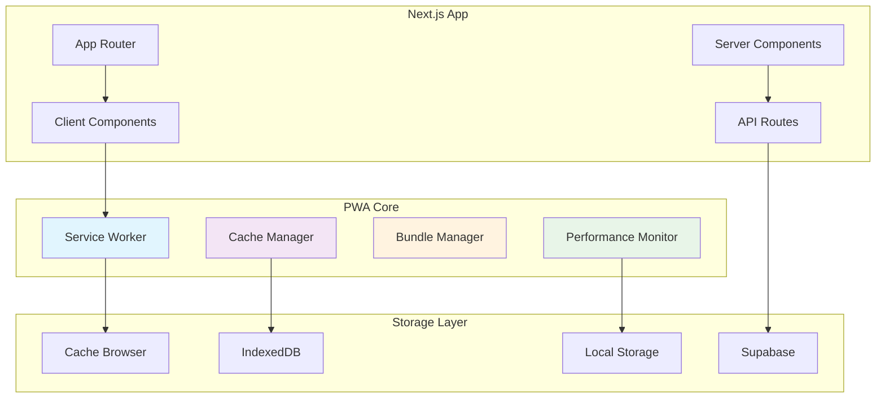

### Service Worker Architecture

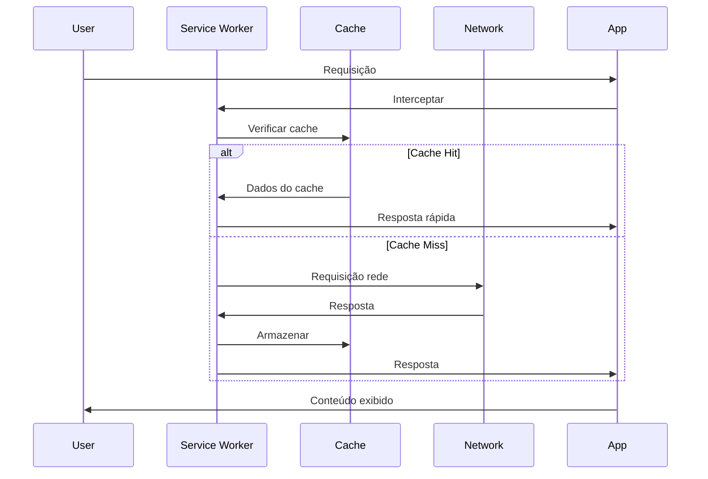

## 3. Service Worker Implementation

### Core Service Worker Structure

```typescript
// Estratégias de Cache por Tipo de Recurso
interface CacheStrategy {
  name: string
  pattern: RegExp
  strategy: 'NetworkFirst' | 'CacheFirst' | 'StaleWhileRevalidate'
  maxEntries?: number
  maxAgeSeconds?: number
}

const cacheStrategies: CacheStrategy[] = [
  {
    name: 'api-cache',
    pattern: /^https:\/\/.*\.supabase\.co\/rest\/v1\//,
    strategy: 'NetworkFirst',
    maxEntries: 50,
    maxAgeSeconds: 300 // 5 minutos
  },
  {
    name: 'static-cache',
    pattern: /\.(?:png|jpg|jpeg|svg|gif|webp)$/,
    strategy: 'CacheFirst',
    maxEntries: 100,
    maxAgeSeconds: 86400 // 24 horas
  },
  {
    name: 'pages-cache',
    pattern: /^https:\/\/stayfocus\.app\//,
    strategy: 'StaleWhileRevalidate',
    maxEntries: 30,
    maxAgeSeconds: 3600 // 1 hora
  }
]
```

### Cache Management System

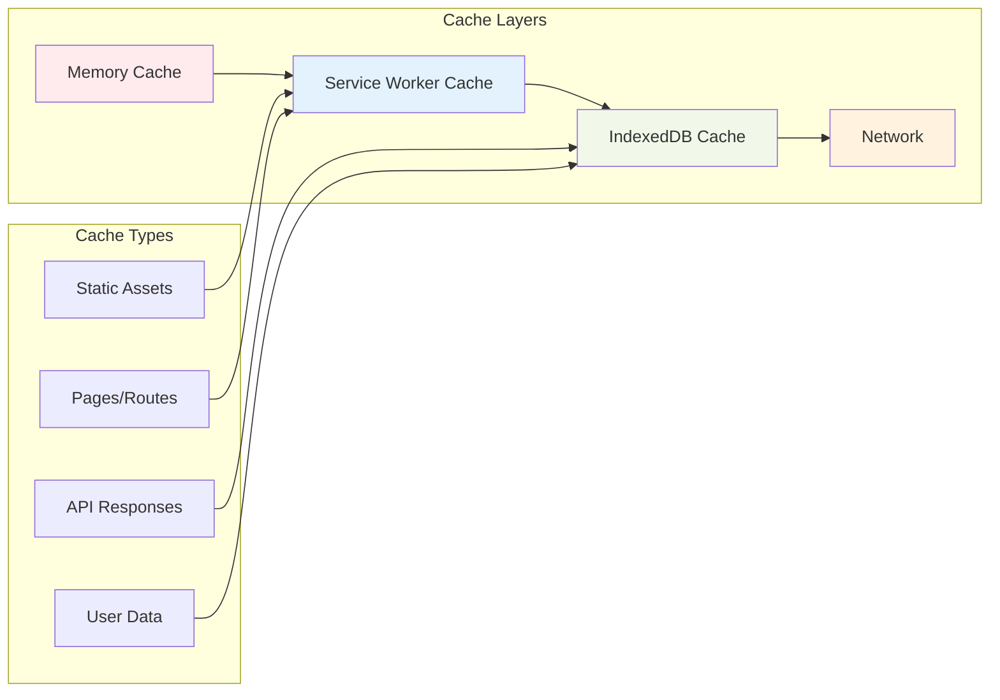

### Offline Data Sync Strategy

```typescript
// Sistema de Sincronização Offline
interface OfflineOperation {
  id: string
  type: 'CREATE' | 'UPDATE' | 'DELETE'
  table: string
  data: any
  timestamp: number
  retryCount: number
}

interface SyncQueue {
  operations: OfflineOperation[]
  maxRetries: number
  retryInterval: number
  isOnline: boolean
}
```

## 4. Bundle Optimization Strategy

### Code Splitting Configuration

```typescript
// Configuração de Code Splitting por Módulo
const moduleConfigs = {
  concursos: {
    priority: 'high',
    preload: true,
    chunkName: 'concursos',
    maxSize: 200 // KB
  },
  alimentacao: {
    priority: 'high', 
    preload: true,
    chunkName: 'alimentacao',
    maxSize: 150
  },
  financas: {
    priority: 'medium',
    preload: false,
    chunkName: 'financas', 
    maxSize: 100
  },
  estudos: {
    priority: 'medium',
    preload: false,
    chunkName: 'estudos',
    maxSize: 120
  }
}
```

### Bundle Analysis Architecture

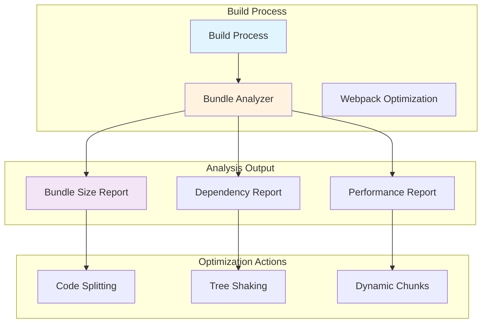

### Webpack Optimization Configuration

```typescript
// Configurações Avançadas de Webpack
const webpackOptimizations = {
  splitChunks: {
    chunks: 'all',
    cacheGroups: {
      vendor: {
        test: /[\\/]node_modules[\\/]/,
        name: 'vendors',
        priority: 10,
        reuseExistingChunk: true
      },
      ui: {
        test: /[\\/]components[\\/]ui[\\/]/,
        name: 'ui-components',
        priority: 20,
        minChunks: 2
      },
      modules: {
        test: /[\\/](alimentacao|concursos|financas)[\\/]/,
        name: (module) => {
          const path = module.context;
          const match = path.match(/[\\/](alimentacao|concursos|financas)[\\/]/);
          return match ? `module-${match[1]}` : 'modules';
        },
        priority: 15,
        minChunks: 1
      }
    }
  },
  minimize: true,
  minimizer: ['TerserPlugin', 'CssMinimizerPlugin'],
  runtimeChunk: {
    name: 'runtime'
  }
}
```

## 5. Lazy Loading Expansion

### Universal Lazy Loading System

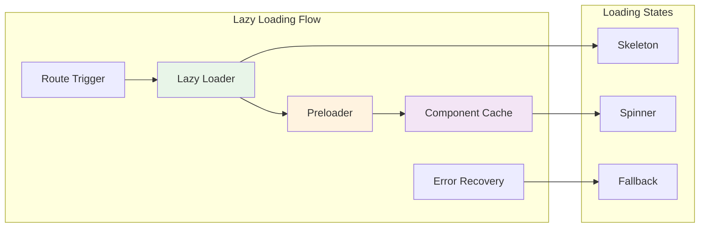

### Dynamic Import Strategy

```typescript
// Sistema de Importação Dinâmica por Prioridade
interface LazyModuleConfig {
  component: () => Promise<any>
  loading: React.ComponentType
  error: React.ComponentType<{error: Error}>
  priority: 'critical' | 'high' | 'medium' | 'low'
  preload: boolean
  prefetch: boolean
}

const lazyModules: Record<string, LazyModuleConfig> = {
  Concursos: {
    component: () => import('@/app/concursos/page'),
    loading: ConcursosSkeleton,
    error: ErrorBoundary,
    priority: 'critical',
    preload: true,
    prefetch: true
  },
  Alimentacao: {
    component: () => import('@/app/alimentacao/page'),
    loading: AlimentacaoSkeleton, 
    error: ErrorBoundary,
    priority: 'high',
    preload: true,
    prefetch: false
  },
  Financas: {
    component: () => import('@/app/financas/page'),
    loading: FinancasSkeleton,
    error: ErrorBoundary,
    priority: 'medium',
    preload: false,
    prefetch: true
  }
}
```

### Preloading Strategy

```typescript
// Sistema de Preload Contextual
interface PreloadContext {
  currentRoute: string
  userHistory: string[]
  timeOfDay: 'morning' | 'afternoon' | 'evening'
  deviceType: 'mobile' | 'desktop'
}

interface PreloadRule {
  condition: (context: PreloadContext) => boolean
  modules: string[]
  priority: number
}

const preloadRules: PreloadRule[] = [
  {
    condition: (ctx) => ctx.currentRoute === '/' && ctx.timeOfDay === 'morning',
    modules: ['Alimentacao', 'Receitas'],
    priority: 1
  },
  {
    condition: (ctx) => ctx.userHistory.includes('/concursos'),
    modules: ['Estudos', 'Simulados'],
    priority: 2
  },
  {
    condition: (ctx) => ctx.deviceType === 'mobile',
    modules: ['Hiperfocos', 'Temporizador'],
    priority: 3
  }
]
```

## 6. Performance Monitoring Integration

### Metrics Collection Architecture

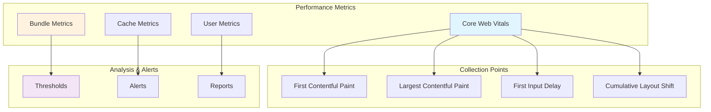

### Performance Budget Definition

```typescript
// Orçamentos de Performance por Módulo
interface PerformanceBudget {
  module: string
  maxBundleSize: number // KB
  maxLoadTime: number // ms
  maxMemoryUsage: number // MB
  minCacheHitRate: number // %
}

const performanceBudgets: PerformanceBudget[] = [
  {
    module: 'dashboard',
    maxBundleSize: 150,
    maxLoadTime: 1000,
    maxMemoryUsage: 50,
    minCacheHitRate: 85
  },
  {
    module: 'concursos',
    maxBundleSize: 200,
    maxLoadTime: 1500,
    maxMemoryUsage: 80,
    minCacheHitRate: 80
  },
  {
    module: 'alimentacao',
    maxBundleSize: 120,
    maxLoadTime: 1200,
    maxMemoryUsage: 60,
    minCacheHitRate: 85
  }
]
```

### Alert System Configuration

```typescript
// Sistema de Alertas de Performance
interface PerformanceAlert {
  metric: string
  threshold: number
  severity: 'CRITICAL' | 'WARNING' | 'INFO'
  action: string[]
}

const alertConfigurations: PerformanceAlert[] = [
  {
    metric: 'bundle_size',
    threshold: 200, // KB
    severity: 'CRITICAL',
    action: ['analyze_bundle', 'code_split', 'tree_shake']
  },
  {
    metric: 'cache_hit_rate',
    threshold: 70, // %
    severity: 'WARNING', 
    action: ['review_cache_strategy', 'adjust_ttl']
  },
  {
    metric: 'first_load_time',
    threshold: 3000, // ms
    severity: 'CRITICAL',
    action: ['enable_preload', 'optimize_critical_path']
  }
]
```

## 7. Implementation Roadmap

### Fase 1: Service Worker Foundation (Semana 1)

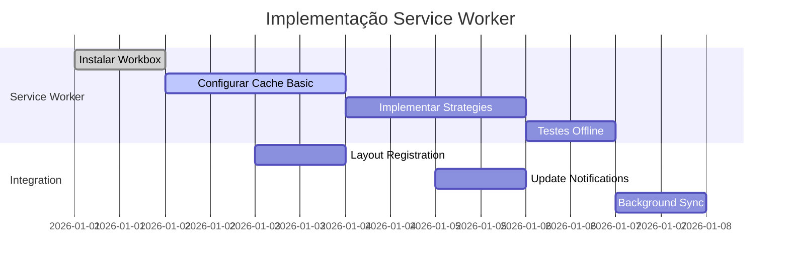

### Fase 2: Bundle Optimization (Semana 2)

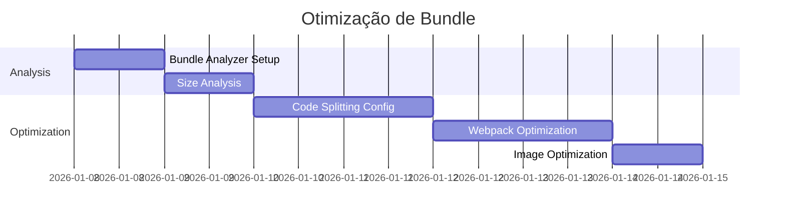

### Fase 3: Lazy Loading Expansion (Semana 3)

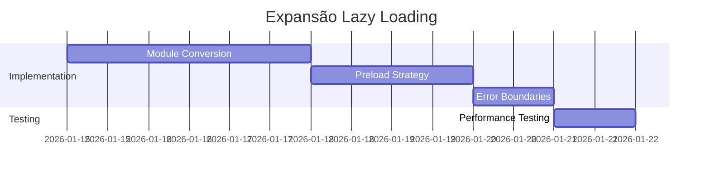

### Fase 4: Performance Monitoring (Semana 4)

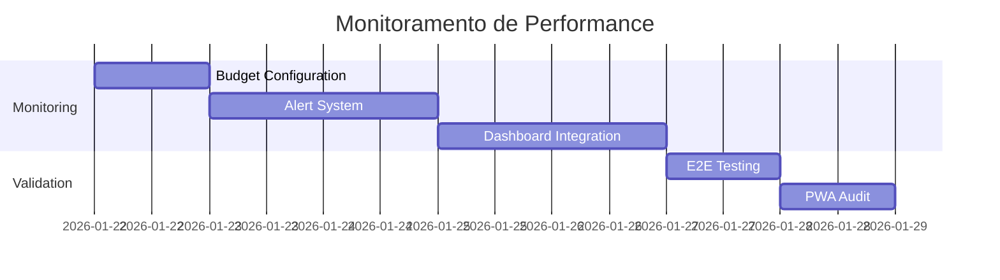

## 8. Configuration Files

### Next.js Configuration Enhancement

```typescript
// next.config.mjs - Configuração Completa PWA
const withPWA = require('next-pwa')({
  dest: 'public',
  register: true,
  skipWaiting: true,
  runtimeCaching: cacheStrategies
})

const withBundleAnalyzer = require('@next/bundle-analyzer')({
  enabled: process.env.ANALYZE === 'true'
})

const nextConfig = {
  typescript: { ignoreBuildErrors: false },
  eslint: { ignoreDuringBuilds: false },
  
  images: {
    unoptimized: false,
    formats: ['image/webp', 'image/avif'],
    domains: ['supabase.co']
  },
  
  experimental: {
    optimizePackageImports: [
      'lucide-react',
      '@radix-ui/react-accordion',
      '@radix-ui/react-dialog', 
      '@radix-ui/react-dropdown-menu',
      '@radix-ui/react-select',
      '@radix-ui/react-tabs',
      'recharts'
    ],
    turbo: {
      resolveExtensions: ['.tsx', '.ts', '.jsx', '.js']
    }
  },
  
  webpack: (config, { dev, isServer }) => {
    if (!dev && !isServer) {
      config.optimization.splitChunks = webpackOptimizations.splitChunks
    }
    return config
  },
  
  async headers() {
    return [
      {
        source: '/(.*)',
        headers: [
          { key: 'X-Frame-Options', value: 'SAMEORIGIN' },
          { key: 'X-Content-Type-Options', value: 'nosniff' },
          { key: 'Cache-Control', value: 'public, max-age=31536000, immutable' }
        ]
      }
    ]
  }
}

export default withBundleAnalyzer(withPWA(nextConfig))
```

### Workbox Configuration

```javascript
// workbox-config.js
module.exports = {
  globDirectory: '.next/',
  globPatterns: [
    '**/*.{html,js,css,png,jpg,jpeg,gif,svg,webp,woff,woff2}'
  ],
  swDest: 'public/sw.js',
  skipWaiting: true,
  clientsClaim: true,
  runtimeCaching: [
    {
      urlPattern: /^https:\/\/.*\.supabase\.co\/rest\/v1\//,
      handler: 'NetworkFirst',
      options: {
        cacheName: 'api-cache',
        networkTimeoutSeconds: 3,
        expiration: {
          maxEntries: 50,
          maxAgeSeconds: 300
        }
      }
    },
    {
      urlPattern: /\.(?:png|jpg|jpeg|svg|gif|webp)$/,
      handler: 'CacheFirst',
      options: {
        cacheName: 'images-cache',
        expiration: {
          maxEntries: 100,
          maxAgeSeconds: 86400
        }
      }
    }
  ]
}
```

## 9. Testing Strategy

### PWA Testing Framework

```typescript
// Estrutura de Testes PWA
interface PWATestSuite {
  serviceWorker: ServiceWorkerTests
  caching: CacheTests
  offline: OfflineTests
  performance: PerformanceTests
}

interface ServiceWorkerTests {
  registration: () => Promise<boolean>
  cacheStrategies: () => Promise<boolean>
  updateMechanism: () => Promise<boolean>
  backgroundSync: () => Promise<boolean>
}

interface PerformanceTests {
  bundleSize: () => Promise<BundleReport>
  loadTimes: () => Promise<LoadTimeReport>
  cacheHitRate: () => Promise<CacheReport>
  webVitals: () => Promise<WebVitalsReport>
}
```

### E2E Testing Scenarios

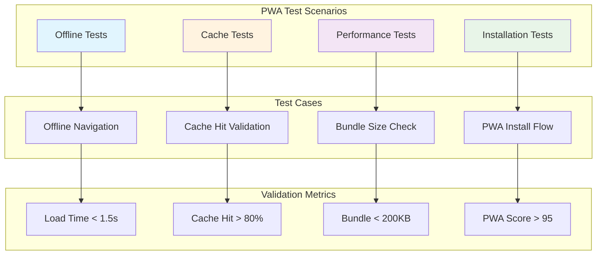

### Performance Validation Criteria

```typescript
// Critérios de Validação de Performance
interface ValidationCriteria {
  pwaSCore: number // > 95
  firstLoad: number // < 1500ms
  lcp: number // < 2500ms
  fid: number // < 100ms
  cls: number // < 0.1
  cacheHitRate: number // > 80%
  bundleSize: number // < 200KB per route
}

const targetMetrics: ValidationCriteria = {
  pwaScore: 95,
  firstLoad: 1500,
  lcp: 2500,
  fid: 100,
  cls: 0.1,
  cacheHitRate: 80,
  bundleSize: 200
}
```

## 10. Risk Management

### Implementation Risks

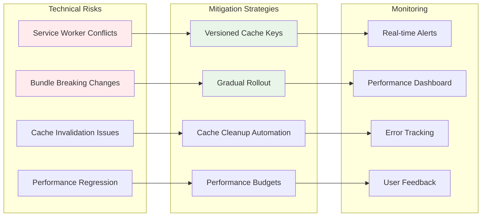

### Rollback Strategy

```typescript
// Estratégia de Rollback
interface RollbackPlan {
  phase: string
  triggers: string[]
  actions: string[]
  fallback: string
}

const rollbackPlans: RollbackPlan[] = [
  {
    phase: 'Service Worker',
    triggers: ['cache_conflicts', 'offline_failures'],
    actions: ['disable_sw', 'clear_cache', 'revert_registration'],
    fallback: 'network_only_mode'
  },
  {
    phase: 'Bundle Optimization',
    triggers: ['build_failures', 'runtime_errors'],
    actions: ['revert_webpack_config', 'disable_code_splitting'],
    fallback: 'monolithic_bundle'
  }
]
```

## 11. Success Metrics

### Key Performance Indicators

| Métrica | Atual | Meta | Criticidade |
|---------|--------|------|-------------|
| PWA Score | 75/100 | 95/100 | Crítica |
| First Load | ~3s | <1.5s | Crítica |
| LCP | ~4s | <2.5s | Alta |
| Bundle Size | 467KB | <200KB | Alta |
| Cache Hit Rate | ~50% | >80% | Média |
| Offline Functionality | 0% | 100% | Crítica |

### Business Impact Targets

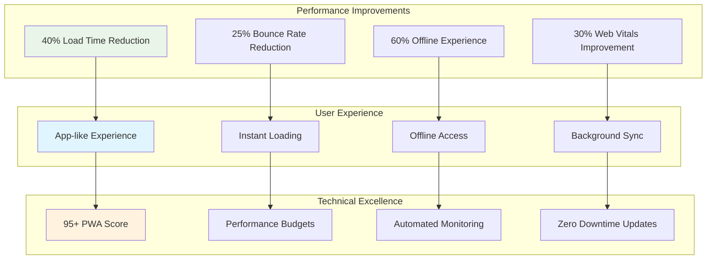