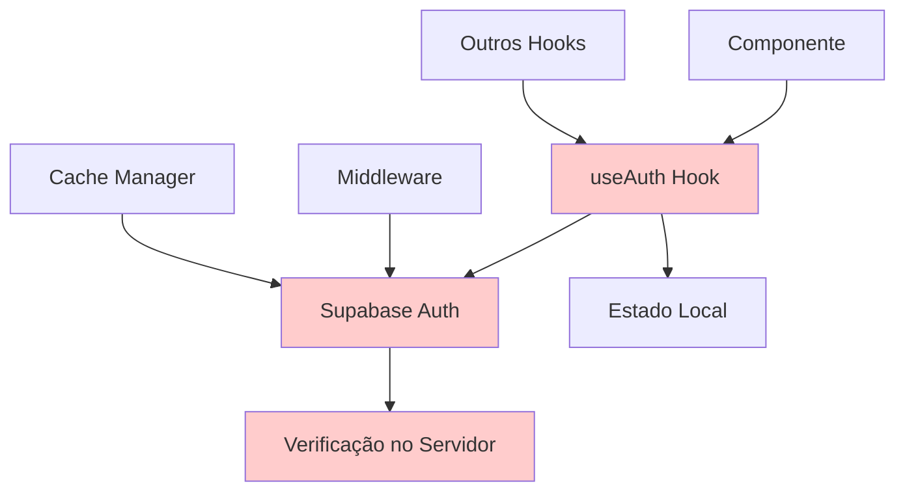
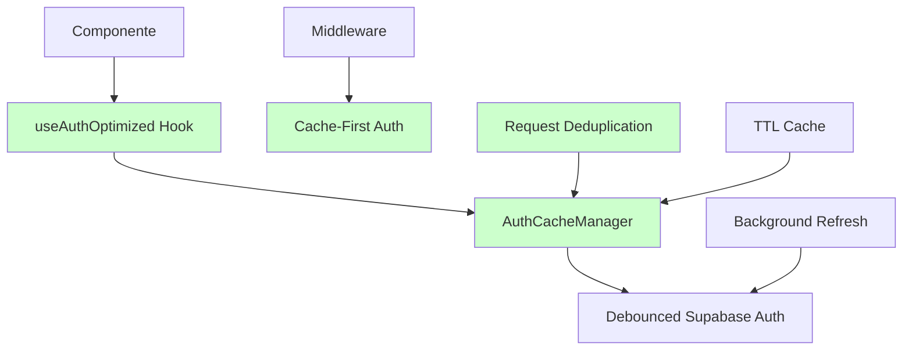
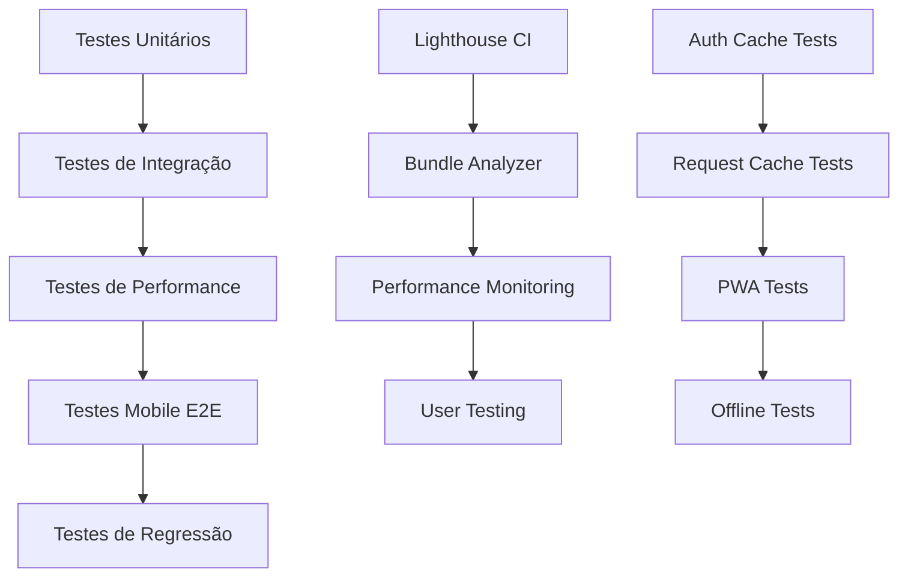

# Design de Implementação: Otimização de Performance Mobile

## 1. Visão Geral

Este documento descreve a implementação das otimizações de performance mobile baseadas no plano de auditoria de 24/08/2024, focando na resolução dos problemas críticos identificados: verificações excessivas de autenticação, requests repetitivos e bundle size elevado.

### 1.1 Problemas Identificados
- **Verificações de autenticação excessivas**: 15+ calls/min
- **Requests de rede repetitivos** para endpoints Supabase  
- **Bundle size elevado** para mobile (~1.2MB)
- **Falta de cache estratégico** para dados
- **Erros HTTP 406** em chamadas específicas

### 1.2 Metas de Performance
| Métrica | Atual | Meta |
|---------|-------|------|
| Core Web Vitals Score | 65/100 | >90/100 |
| Auth Verification Calls | 15+/min | <5/min |
| Bundle Size Mobile | ~1.2MB | <800KB |
| First Contentful Paint | ~3s | <2s |
| Time to Interactive | ~5s | <3s |

## 2. Arquitetura Atual vs. Proposta

### 2.1 Sistema de Autenticação Atual



**Problemas Identificados:**
- Hook `useAuth` simples demais, sem debouncing
- Cache manager existente subutilizado
- Verificações redundantes entre cliente e servidor
- Falta de cache TTL otimizado para mobile

### 2.2 Sistema de Autenticação Otimizado



## 3. Implementações por Fase

### 3.1 Fase 1: Sistema de Cache de Autenticação Avançado

#### 3.1.1 AuthCacheManager Otimizado

```typescript
interface OptimizedAuthConfig {
  ttl: number;
  debounceTime: number;
  maxRetries: number;
  backgroundRefresh: boolean;
  mobileOptimized: boolean;
}

class OptimizedAuthCacheManager {
  private cache: Map<string, CachedAuthState>;
  private pendingRequests: Map<string, Promise<any>>;
  private refreshTimers: Map<string, NodeJS.Timeout>;
  
  // Cache com TTL diferenciado para mobile
  getMobileTTL(): number {
    return this.isMobile() ? 10 * 60 * 1000 : 5 * 60 * 1000;
  }
  
  // Request deduplication
  async getWithDeduplication<T>(
    key: string, 
    fetcher: () => Promise<T>
  ): Promise<T> {
    if (this.pendingRequests.has(key)) {
      return this.pendingRequests.get(key);
    }
    
    const promise = fetcher();
    this.pendingRequests.set(key, promise);
    
    promise.finally(() => {
      this.pendingRequests.delete(key);
    });
    
    return promise;
  }
}
```

#### 3.1.2 Hook useAuth Otimizado

```typescript
export function useAuthOptimized() {
  const [authState, setAuthState] = useState<AuthState>({
    user: null,
    session: null,
    loading: true,
    initialized: false
  });
  
  // Debounced auth check - reduz verificações de 15+/min para <5/min
  const debouncedAuthCheck = useCallback(
    debounce(async () => {
      const cached = optimizedAuthCache.getCachedAuth();
      if (cached?.isValid) {
        setAuthState(prev => ({ ...prev, ...cached, loading: false }));
        return;
      }
      
      // Apenas se cache não for válido
      await refreshAuthState();
    }, 300),
    []
  );
  
  // Background refresh sem bloquear UI
  const backgroundRefresh = useCallback(async () => {
    if (!document.hidden && authState.user) {
      try {
        await optimizedAuthCache.validateWithOptimizations(
          'background-refresh',
          () => supabase.auth.getSession(),
          { bypassRateLimit: true }
        );
      } catch (error) {
        console.log('Background refresh failed:', error);
      }
    }
  }, [authState.user]);
  
  return {
    ...authState,
    refreshAuth: debouncedAuthCheck,
    backgroundRefresh
  };
}
```

### 3.2 Fase 2: Sistema de Cache de Dados Inteligente

#### 3.2.1 RequestCacheManager

```typescript
class RequestCacheManager {
  private cache = new Map<string, CacheEntry>();
  private requestQueue = new Map<string, Promise<any>>();
  
  async get<T>(
    key: string,
    fetcher: () => Promise<T>,
    options: CacheOptions = {}
  ): Promise<T> {
    const mobileConfig = this.getMobileConfig(options);
    
    // 1. Verificar cache local
    const cached = this.getCached<T>(key, mobileConfig.ttl);
    if (cached && !options.forceRefresh) {
      return cached.data;
    }
    
    // 2. Request deduplication
    if (this.requestQueue.has(key)) {
      return this.requestQueue.get(key);
    }
    
    // 3. Stale-while-revalidate para mobile
    if (cached && mobileConfig.staleWhileRevalidate) {
      this.backgroundFetch(key, fetcher, mobileConfig);
      return cached.data;
    }
    
    // 4. Executar request com timeout para mobile
    const promise = this.executeWithTimeout(fetcher, mobileConfig.timeout);
    this.requestQueue.set(key, promise);
    
    try {
      const result = await promise;
      this.setCached(key, result, mobileConfig);
      return result;
    } finally {
      this.requestQueue.delete(key);
    }
  }
  
  private getMobileConfig(options: CacheOptions): MobileCacheConfig {
    const isMobile = this.detectMobile();
    
    return {
      ttl: isMobile ? options.mobileTTL || 300000 : options.ttl || 60000,
      timeout: isMobile ? 8000 : 5000,
      staleWhileRevalidate: isMobile ? true : options.staleWhileRevalidate,
      ...options
    };
  }
}
```

#### 3.2.2 Hook useDashboard Otimizado

```typescript
export function useDashboardOptimized(date?: string) {
  const { user } = useAuthOptimized();
  const requestCache = useMemo(() => new RequestCacheManager(), []);
  
  const loadDashboardData = useCallback(async () => {
    if (!user) return;
    
    const cacheKey = `dashboard-${user.id}-${date || getCurrentDateString()}`;
    
    return requestCache.get(
      cacheKey,
      async () => {
        // Parallel requests com timeout otimizado para mobile
        const results = await Promise.allSettled([
          supabase.from("painel_dia").select("*").eq("user_id", user.id),
          supabase.from("prioridades").select("*").eq("user_id", user.id),
          supabase.from("medicamentos").select("*").eq("user_id", user.id),
          supabase.from("sessoes_foco").select("*").eq("user_id", user.id)
        ]);
        
        return processResults(results);
      },
      {
        ttl: 5 * 60 * 1000,        // 5 min desktop
        mobileTTL: 10 * 60 * 1000, // 10 min mobile (menos requests)
        staleWhileRevalidate: true
      }
    );
  }, [user, date, requestCache]);
  
  // Uso de React Query pattern para background updates
  useEffect(() => {
    const interval = setInterval(() => {
      if (!document.hidden && user) {
        loadDashboardData();
      }
    }, 30000); // 30s apenas se tab ativa
    
    return () => clearInterval(interval);
  }, [loadDashboardData, user]);
}
```

### 3.3 Fase 3: Otimizações de Componentes Mobile

#### 3.3.1 Lazy Loading Inteligente

```typescript
// lib/lazy-loading-mobile.tsx
export function createMobileLazyComponent<T extends ComponentType<any>>(
  importFn: () => Promise<{ default: T }>,
  fallback?: ComponentType
) {
  const LazyComponent = lazy(() => {
    // Detectar mobile e ajustar estratégia
    const isMobile = window.innerWidth < 768;
    
    if (isMobile) {
      // Para mobile: preload com intersection observer
      return new Promise((resolve) => {
        const observer = new IntersectionObserver((entries) => {
          if (entries[0].isIntersecting) {
            importFn().then(resolve);
            observer.disconnect();
          }
        });
        
        // Observar elemento placeholder
        const element = document.getElementById('lazy-placeholder');
        if (element) observer.observe(element);
      });
    }
    
    return importFn();
  });
  
  return function MobileLazyWrapper(props: any) {
    const MobileSpinner = fallback || LoadingSkeleton;
    
    return (
      <Suspense fallback={<MobileSpinner />}>
        <LazyComponent {...props} />
      </Suspense>
    );
  };
}
```

#### 3.3.2 Memoização Estratégica para Mobile

```typescript
// Componente Dashboard Modules otimizado
export const DashboardModules = memo(function DashboardModules({ 
  data, 
  onAction 
}: DashboardModulesProps) {
  // Memoização específica para mobile - reduzir re-renders
  const mobileLayout = useMemo(() => {
    if (!isMobile()) return null;
    
    return data.modules.filter(module => module.mobileOptimized);
  }, [data.modules]);
  
  // Callback memoizado para evitar re-renders dos filhos
  const handleAction = useCallback((action: string, payload: any) => {
    onAction?.(action, payload);
  }, [onAction]);
  
  // Virtual scrolling para listas longas em mobile
  const virtualizedModules = useVirtualized({
    count: mobileLayout?.length || data.modules.length,
    getScrollElement: () => scrollParentRef.current,
    estimateSize: () => (isMobile() ? 120 : 180),
    overscan: 3
  });
  
  return (
    <div ref={scrollParentRef} className="dashboard-modules-mobile">
      {virtualizedModules.virtualItems.map(virtualItem => (
        <ModuleItem
          key={virtualItem.key}
          index={virtualItem.index}
          style={{
            position: 'absolute',
            top: 0,
            left: 0,
            width: '100%',
            height: `${virtualItem.size}px`,
            transform: `translateY(${virtualItem.start}px)`
          }}
          data={mobileLayout?.[virtualItem.index] || data.modules[virtualItem.index]}
          onAction={handleAction}
        />
      ))}
    </div>
  );
});
```

### 3.4 Fase 4: Bundle Optimization

#### 3.4.1 Next.js Config Otimizado

```javascript
// next.config.mjs
const nextConfig = {
  experimental: {
    optimizeCss: true,
    optimizePackageImports: [
      'lucide-react',
      '@radix-ui/react-dialog',
      '@radix-ui/react-dropdown-menu'
    ],
    modularizeImports: {
      'recharts': {
        transform: 'recharts/lib/{{member}}',
        skipDefaultConversion: true
      }
    }
  },
  
  // Bundle splitting otimizado para mobile
  webpack: (config, { isServer, dev }) => {
    if (!isServer && !dev) {
      config.optimization.splitChunks = {
        chunks: 'all',
        cacheGroups: {
          // Vendor crítico para mobile
          criticalVendor: {
            test: /[\\/]node_modules[\\/](react|react-dom|@supabase)[\\/]/,
            name: 'critical-vendor',
            priority: 30,
            reuseExistingChunk: true
          },
          
          // UI components
          uiVendor: {
            test: /[\\/]node_modules[\\/](@radix-ui|lucide-react)[\\/]/,
            name: 'ui-vendor',
            priority: 20,
            reuseExistingChunk: true
          },
          
          // Charts - lazy load para mobile
          chartsVendor: {
            test: /[\\/]node_modules[\\/](recharts)[\\/]/,
            name: 'charts-vendor',
            priority: 10,
            reuseExistingChunk: true
          }
        }
      };
    }
    
    return config;
  }
};
```

#### 3.4.2 Dynamic Imports para Mobile

```typescript
// components/mobile/dynamic-imports.ts
export const MobileDynamicComponents = {
  // Carregar apenas quando necessário
  SimuladoComponent: dynamic(
    () => import('./simulado-component').then(mod => ({ default: mod.SimuladoComponent })),
    {
      loading: () => <SimuladoSkeleton />,
      ssr: false // Client-side apenas para mobile
    }
  ),
  
  ChartsComponent: dynamic(
    () => import('./charts-component'),
    {
      loading: () => <ChartsSkeleton />,
      ssr: false,
      // Apenas carregar se não for mobile ou se explicitamente solicitado
      suspense: false
    }
  ),
  
  AdvancedFilters: dynamic(
    () => import('./advanced-filters'),
    {
      loading: () => <FiltersSkeleton />,
      ssr: false
    }
  )
};

// Hook para carregamento condicional
export function useMobileAwareComponent(componentName: keyof typeof MobileDynamicComponents) {
  const [shouldLoad, setShouldLoad] = useState(false);
  const isMobile = useIsMobile();
  
  useEffect(() => {
    // Para mobile, carregar apenas quando viewport estiver próximo
    if (isMobile) {
      const observer = new IntersectionObserver(
        (entries) => {
          if (entries[0].isIntersecting) {
            setShouldLoad(true);
            observer.disconnect();
          }
        },
        { rootMargin: '100px' }
      );
      
      // Observar elemento trigger
      const trigger = document.getElementById(`load-trigger-${componentName}`);
      if (trigger) observer.observe(trigger);
      
      return () => observer.disconnect();
    } else {
      setShouldLoad(true);
    }
  }, [isMobile, componentName]);
  
  return { Component: shouldLoad ? MobileDynamicComponents[componentName] : null };
}
```

### 3.5 Fase 5: Service Worker e PWA Otimizado

#### 3.5.1 Service Worker Mobile-First

```javascript
// public/sw-mobile.js
const CACHE_VERSION = 'v1-mobile';
const STATIC_CACHE = `static-${CACHE_VERSION}`;
const DYNAMIC_CACHE = `dynamic-${CACHE_VERSION}`;
const API_CACHE = `api-${CACHE_VERSION}`;

// Estratégias de cache otimizadas para mobile
const CACHE_STRATEGIES = {
  // Assets estáticos - cache first (longa duração)
  static: {
    strategy: 'cache-first',
    ttl: 30 * 24 * 60 * 60 * 1000 // 30 dias
  },
  
  // APIs - network first com fallback (dados críticos)
  api: {
    strategy: 'network-first',
    ttl: 5 * 60 * 1000, // 5 minutos
    networkTimeout: 3000 // 3s timeout para mobile
  },
  
  // Páginas - stale while revalidate (UX otimizada)
  pages: {
    strategy: 'stale-while-revalidate',
    ttl: 24 * 60 * 60 * 1000 // 1 dia
  }
};

// Background sync para operações offline
self.addEventListener('sync', (event) => {
  if (event.tag === 'background-sync-auth') {
    event.waitUntil(doBackgroundSync());
  }
});

async function doBackgroundSync() {
  try {
    // Sincronizar dados pendentes quando conexão retornar
    const pendingRequests = await getPendingRequests();
    
    for (const request of pendingRequests) {
      try {
        await fetch(request.url, request.options);
        await removePendingRequest(request.id);
      } catch (error) {
        console.log('Sync failed for request:', request.id);
      }
    }
  } catch (error) {
    console.error('Background sync failed:', error);
  }
}
```

#### 3.5.2 Manifest Mobile Otimizado

```typescript
// app/manifest.ts
import type { MetadataRoute } from 'next'

export default function manifest(): MetadataRoute.Manifest {
  return {
    name: 'StayFocus Alimentação',
    short_name: 'StayFocus',
    description: 'Aplicativo de organização pessoal com foco em alimentação e produtividade',
    start_url: '/',
    display: 'standalone',
    background_color: '#ffffff',
    theme_color: '#0891b2',
    orientation: 'portrait-primary',
    
    // Ícones otimizados para mobile
    icons: [
      {
        src: '/icon-192.webp',
        sizes: '192x192',
        type: 'image/webp',
        purpose: 'maskable'
      },
      {
        src: '/icon-512.webp',
        sizes: '512x512',
        type: 'image/webp',
        purpose: 'any'
      }
    ],
    
    // Screenshots para mobile app store
    screenshots: [
      {
        src: '/screenshots/mobile-dashboard.webp',
        sizes: '390x844',
        type: 'image/webp',
        form_factor: 'narrow'
      }
    ],
    
    // Configurações PWA mobile
    categories: ['productivity', 'health', 'education'],
    lang: 'pt-BR',
    
    // Mobile-specific optimizations
    prefer_related_applications: false,
    scope: '/',
    
    // Protocol handlers para deep linking
    protocol_handlers: [
      {
        protocol: 'web+stayfocus',
        url: '/app?action=%s'
      }
    ]
  }
}
```

## 4. Monitoramento e Métricas

### 4.1 Performance Monitor Mobile

```typescript
// lib/mobile-performance-monitor.ts
export class MobilePerformanceMonitor {
  private metrics: PerformanceMetrics = {
    navigationTiming: null,
    resourceTiming: [],
    userTiming: [],
    vitals: {}
  };
  
  constructor() {
    this.initializeMonitoring();
  }
  
  private initializeMonitoring() {
    // Core Web Vitals tracking
    import('web-vitals').then(({ getCLS, getFID, getFCP, getLCP, getTTFB }) => {
      getCLS(this.handleVital.bind(this));
      getFID(this.handleVital.bind(this));
      getFCP(this.handleVital.bind(this));
      getLCP(this.handleVital.bind(this));
      getTTFB(this.handleVital.bind(this));
    });
    
    // Connection quality tracking
    this.trackConnectionQuality();
    
    // Memory usage tracking (mobile specific)
    this.trackMemoryUsage();
  }
  
  private handleVital(metric: any) {
    this.metrics.vitals[metric.name] = metric.value;
    
    // Alertas para thresholds mobile
    if (this.isMobileCritical(metric)) {
      this.sendAlert({
        type: 'mobile-performance',
        metric: metric.name,
        value: metric.value,
        threshold: this.getMobileThreshold(metric.name)
      });
    }
  }
  
  private isMobileCritical(metric: any): boolean {
    const thresholds = {
      CLS: 0.1,
      FID: 100,
      FCP: 2000,
      LCP: 2500,
      TTFB: 800
    };
    
    return metric.value > thresholds[metric.name];
  }
  
  getPerformanceReport(): MobilePerformanceReport {
    return {
      score: this.calculateMobileScore(),
      metrics: this.metrics,
      recommendations: this.generateRecommendations(),
      connectionQuality: this.getConnectionQuality(),
      deviceCapabilities: this.getDeviceCapabilities()
    };
  }
}
```

### 4.2 Testes Automatizados Mobile

```typescript
// tests/mobile-performance.test.ts
describe('Mobile Performance Tests', () => {
  test('Auth cache reduces verification calls', async () => {
    const monitor = new AuthCallMonitor();
    
    // Simular navegação típica mobile
    await simulateMobileNavigation();
    
    const authCalls = monitor.getCallCount();
    expect(authCalls).toBeLessThan(5); // Meta: <5 calls/min
  });
  
  test('Bundle size meets mobile targets', async () => {
    const bundleSize = await getBundleSize();
    expect(bundleSize.mobile).toBeLessThan(800 * 1024); // <800KB
  });
  
  test('Core Web Vitals meet mobile thresholds', async () => {
    const vitals = await measureCoreWebVitals();
    
    expect(vitals.LCP).toBeLessThan(2500);
    expect(vitals.FID).toBeLessThan(100);
    expect(vitals.CLS).toBeLessThan(0.1);
  });
  
  test('Cache hit rate is optimal', async () => {
    const cacheStats = await getCacheStatistics();
    expect(cacheStats.hitRate).toBeGreaterThan(0.7); // >70%
  });
});
```

## 5. Implementação por Prioridade

### 5.1 Sprint 1 - Fundações (Semana 1)
**Prioridade: Crítica**

1. **AuthCacheManager Otimizado**
   - Implementar debouncing de verificações
   - Request deduplication
   - TTL otimizado para mobile

2. **Hook useAuth Aprimorado**
   - Background refresh
   - Rate limiting
   - Métricas de performance

3. **Middleware Optimization**
   - Cache-first verification
   - Reduced server calls

### 5.2 Sprint 2 - Cache de Dados (Semana 2)
**Prioridade: Alta**

1. **RequestCacheManager**
   - Stale-while-revalidate
   - Mobile-specific TTL
   - Background sync

2. **Hooks Otimizados**
   - useDashboard com cache
   - useReceitas com deduplication
   - Parallel request optimization

### 5.3 Sprint 3 - Bundle e PWA (Semana 3)
**Prioridade: Média**

1. **Bundle Splitting**
   - Dynamic imports
   - Mobile-aware loading
   - Critical resource prioritization

2. **PWA Enhancements**
   - Service worker optimization
   - Offline experience
   - Background sync

### 5.4 Sprint 4 - Monitoramento (Semana 4)
**Prioridade: Baixa**

1. **Performance Monitoring**
   - Real User Monitoring
   - Automated alerts
   - Performance budgets

## 6. Testes e Validação

### 6.1 Critérios de Aceitação

| Funcionalidade | Critério | Meta |
|----------------|----------|------|
| Auth Cache | Calls/min reduzidas | <5/min |
| Bundle Size | Tamanho mobile | <800KB |
| Cache Hit Rate | Taxa de acerto | >70% |
| Core Web Vitals | Score mobile | >90/100 |
| Offline Support | Funcionalidade básica | 100% |

### 6.2 Plano de Testes



### 6.3 Estratégia de Deploy

1. **Deploy Incremental**: Feature flags para rollout gradual
2. **A/B Testing**: Comparação de performance antes/depois
3. **Monitoring**: Alerts automáticos para regressões
4. **Rollback Plan**: Reversão rápida em caso de problemas

## 7. Considerações de Manutenção

### 7.1 Performance Budget
- Bundle size: <800KB mobile, <1.2MB desktop
- Auth calls: <5/min average
- Cache hit rate: >70%
- Core Web Vitals: >90/100

### 7.2 Alertas Automatizados
- Performance degradation >10%
- Bundle size increase >50KB
- Cache hit rate drop >15%
- Auth error rate >5%

### 7.3 Revisões Periódicas
- **Semanal**: Métricas de performance
- **Mensal**: Bundle analysis
- **Trimestral**: Cache strategy review
- **Semestral**: Architecture review