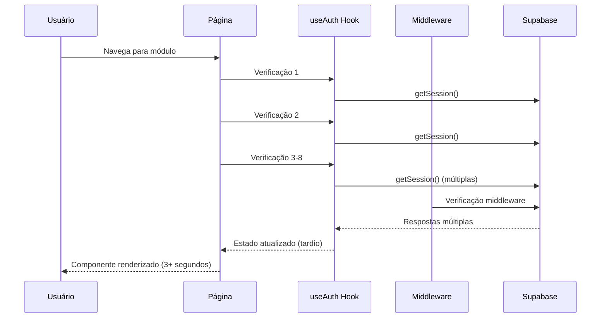
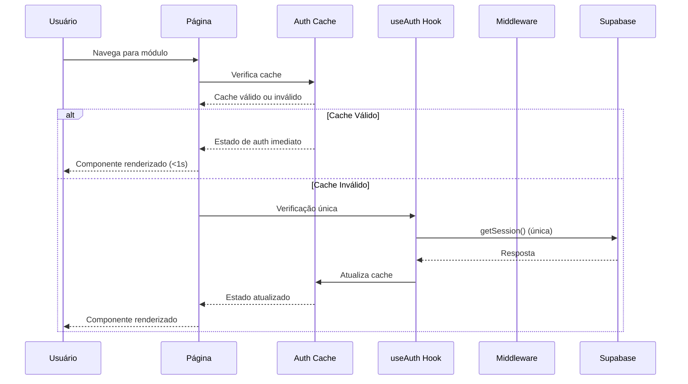
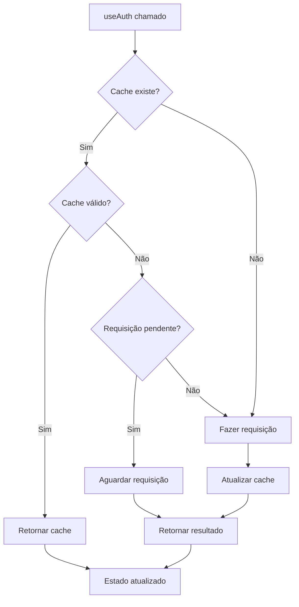
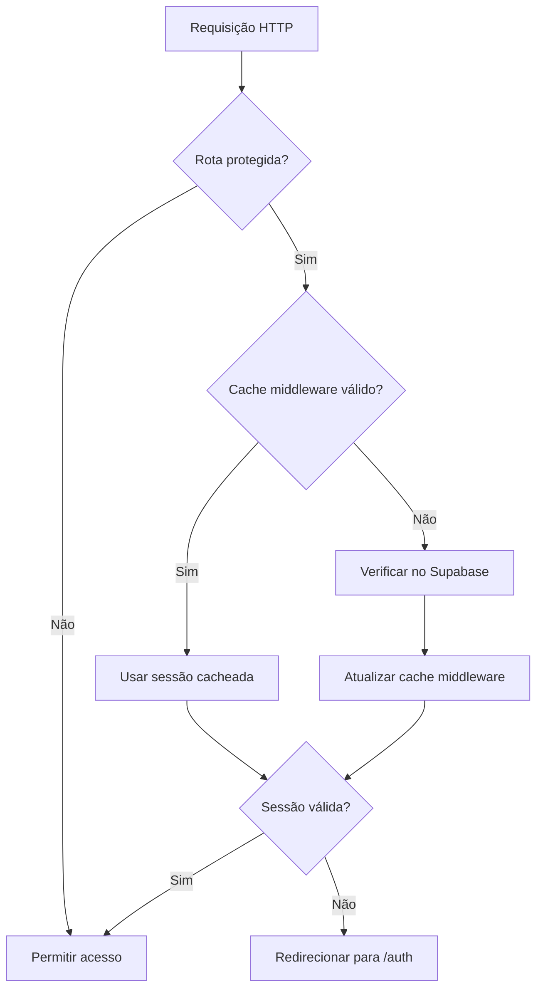
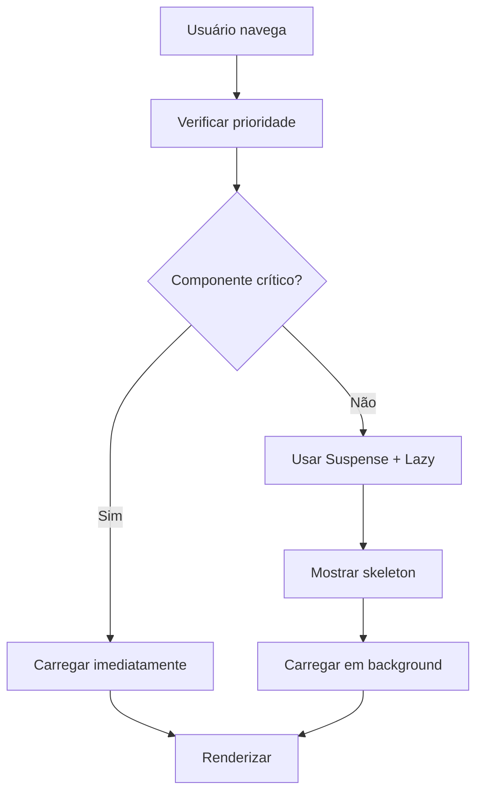
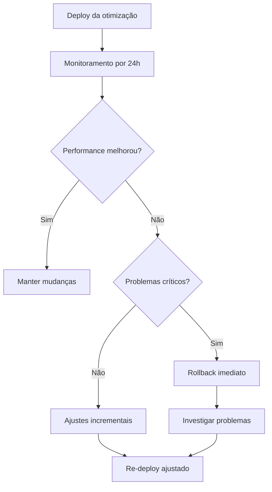

# Otimização de Performance - Sistema StayFocus

## Visão Geral

Esta proposta de design visa resolver os problemas críticos de performance identificados na auditoria mobile da aplicação StayFocus, com foco principal na otimização do sistema de autenticação que está gerando verificações redundantes e impactando significativamente a experiência do usuário.

### Problemas Identificados
- **Múltiplas verificações de autenticação redundantes**: 8-25 verificações por navegação entre módulos
- **Timeout no carregamento de componentes**: Módulo Concursos com 3+ segundos de carregamento
- **Requisições excessivas para API Supabase**: Até 8 chamadas GET `/auth/v1/user` por módulo
- **Impacto na UX**: Experiência de usuário comprometida em dispositivos móveis

## Arquitetura Atual vs. Proposta

### Estado Atual - Problemas de Performance



### Arquitetura Proposta - Sistema Otimizado



## Componentes de Otimização

### 1. Sistema de Cache de Autenticação

#### AuthCache Manager
```typescript
interface AuthCacheConfig {
  ttl: number; // Time to live em milliseconds
  maxRetries: number;
  debounceTime: number;
}

interface CachedAuthState {
  user: User | null;
  session: Session | null;
  timestamp: number;
  expiry: number;
}

class AuthCacheManager {
  private cache: CachedAuthState | null = null;
  private config: AuthCacheConfig;
  private pendingRequest: Promise<void> | null = null;
  
  isValid(): boolean;
  get(): CachedAuthState | null;
  set(user: User | null, session: Session | null): void;
  clear(): void;
  refresh(): Promise<void>;
}
```

#### Estrutura do Cache
| Campo | Tipo | Descrição |
|-------|------|-----------|
| `user` | User \| null | Objeto do usuário autenticado |
| `session` | Session \| null | Sessão atual do Supabase |
| `timestamp` | number | Timestamp da última atualização |
| `expiry` | number | Timestamp de expiração do cache |

### 2. Hook useAuth Otimizado

#### Fluxo de Verificação Inteligente


#### Interface do Hook Otimizado
```typescript
interface OptimizedAuthHook {
  // Estado
  user: User | null;
  session: Session | null;
  loading: boolean;
  initialized: boolean;
  isAuthenticated: boolean;
  
  // Funções
  signIn: (email: string, password: string) => Promise<void>;
  signUp: (email: string, password: string) => Promise<void>;
  signOut: () => Promise<void>;
  refreshSession: () => Promise<void>;
  
  // Otimizações
  clearCache: () => void;
  forceSyncAuth: () => Promise<void>;
}
```

### 3. Middleware Otimizado

#### Proteção de Rotas Inteligente
```typescript
interface MiddlewareConfig {
  protectedRoutes: string[];
  cacheConfig: {
    enabled: boolean;
    ttl: number;
  };
  rateLimiting: {
    enabled: boolean;
    maxRequests: number;
    windowMs: number;
  };
}
```

#### Fluxo do Middleware


### 4. Lazy Loading de Componentes

#### Estratégia de Carregamento
```typescript
// Componentes por prioridade
const LOADING_PRIORITY = {
  CRITICAL: ['Dashboard', 'Auth'],
  HIGH: ['Saude', 'Estudos', 'Financas'],
  MEDIUM: ['Sono', 'Lazer'],
  LOW: ['Concursos', 'Receitas']
};

// Implementação de lazy loading
const LazyModuleLoader = React.lazy(() => 
  import('./ModuleComponent').then(module => ({
    default: module.ModuleComponent
  }))
);
```

#### Componente de Loading Inteligente


### 5. Debouncing e Rate Limiting

#### Sistema de Debouncing
```typescript
interface DebounceConfig {
  authChecks: number;    // 300ms
  apiCalls: number;      // 500ms
  userInteractions: number; // 100ms
}

class RequestDebouncer {
  private pendingRequests: Map<string, Timer>;
  
  debounce<T>(key: string, fn: () => Promise<T>, delay: number): Promise<T>;
  cancel(key: string): void;
  cancelAll(): void;
}
```

#### Implementação do Rate Limiting
| Operação | Limite | Janela | Estratégia |
|----------|--------|--------|------------|
| Auth Checks | 1 por rota | 1 segundo | Debounce |
| API Calls | 5 por endpoint | 1 segundo | Queue |
| User Actions | 10 por tipo | 5 segundos | Throttle |

## Otimizações por Módulo

### Dashboard Principal
- **Problema atual**: 4-6 verificações de autenticação
- **Solução**: Cache de auth + lazy loading de widgets
- **Meta**: < 1 segundo de carregamento

### Módulo Concursos (Crítico)
- **Problema atual**: 25+ verificações, 3+ segundos
- **Solução**: 
  - Cache agressivo de dados de concurso
  - Lazy loading de componentes pesados
  - Pré-carregamento de dados críticos
- **Meta**: < 1.5 segundos de carregamento

### Módulos Gerais (Saúde, Estudos, Finanças, Sono)
- **Problema atual**: 6-9 verificações cada
- **Solução**: Cache compartilhado + debouncing
- **Meta**: < 1.2 segundos de carregamento

## Implementação Técnica

### Fase 1: Sistema de Cache (2-3 dias)
```typescript
// 1. Implementar AuthCacheManager
// 2. Integrar no useAuth hook
// 3. Adicionar TTL configurável
// 4. Implementar invalidação automática
```

### Fase 2: Otimização de Middleware (1 dia)
```typescript
// 1. Cache de sessões no middleware
// 2. Rate limiting para requisições
// 3. Logs estruturados para debugging
```

### Fase 3: Lazy Loading (1-2 dias)
```typescript
// 1. Componentes críticos vs. não-críticos
// 2. Suspense boundaries
// 3. Error boundaries para falhas
// 4. Skeleton loading states
```

### Fase 4: Debouncing (1 dia)
```typescript
// 1. Debouncer centralizado
// 2. Configuração por tipo de operação
// 3. Cancelamento de requisições pendentes
```

## Monitoramento e Métricas

### KPIs de Performance
| Métrica | Atual | Meta | Melhoria |
|---------|-------|------|----------|
| Tempo médio de carregamento | 2.5s | < 1.5s | 40% |
| Verificações de auth por navegação | 8-25 | 1-2 | 85% |
| Requisições API por módulo | 8 | 2-3 | 70% |
| Taxa de abandono | Atual | < 5% | TBD |

### Sistema de Monitoramento
```typescript
interface PerformanceMetrics {
  loadTime: number;
  authChecks: number;
  apiCalls: number;
  cacheHitRate: number;
  errorRate: number;
}

class PerformanceMonitor {
  track(metric: keyof PerformanceMetrics, value: number): void;
  getReport(timeframe: string): PerformanceReport;
  setAlerts(thresholds: AlertThresholds): void;
}
```

### Alertas de Performance
- **Carregamento > 2s**: Alerta crítico
- **Cache hit rate < 70%**: Alerta médio
- **Auth checks > 3 por navegação**: Alerta alto
- **Error rate > 5%**: Alerta crítico

## Estratégia de Rollback

### Plano de Contingência


### Critérios de Rollback
- Tempo de carregamento > situação anterior
- Taxa de erro > 10%
- Cache corruption detectado
- Performance em mobile < 50% da meta

## Validação e Testes

### Estratégia de Testing
1. **Testes de unidade**: AuthCacheManager, debouncer
2. **Testes de integração**: useAuth hook + cache
3. **Testes E2E**: Navegação entre módulos
4. **Testes de performance**: Playwright + métricas

### Cenários de Teste
| Cenário | Descrição | Métrica Esperada |
|---------|-----------|------------------|
| Navegação rápida | Trocar entre 5 módulos em 10s | < 1.5s por módulo |
| Cache expiry | Testar invalidação automática | Renovação transparente |
| Falha de rede | Comportamento offline/online | Fallback para cache |
| Múltiplas abas | Sincronização de auth | Estado consistente |

## Cronograma de Implementação

### Semana 1-2: Otimizações Críticas
- [ ] **Dia 1-3**: Sistema de cache de autenticação
- [ ] **Dia 4-5**: Otimização do useAuth hook  
- [ ] **Dia 6-7**: Middleware otimizado
- [ ] **Dia 8-10**: Correção específica módulo Concursos

### Semana 3: Melhorias Secundárias
- [ ] **Dia 11-12**: Lazy loading de componentes
- [ ] **Dia 13-14**: Sistema de debouncing
- [ ] **Dia 15**: Testes e validação inicial

### Semana 4: Finalização
- [ ] **Dia 16-17**: Monitoramento e métricas
- [ ] **Dia 18-19**: Testes de performance
- [ ] **Dia 20-21**: Ajustes finais e documentação

## Riscos e Mitigações

### Riscos Identificados
| Risco | Probabilidade | Impacto | Mitigação |
|-------|---------------|---------|-----------|
| Cache corruption | Baixa | Alto | Validação + fallback |
| Incompatibilidade Supabase | Média | Alto | Testes extensivos |
| Regressão de funcionalidade | Média | Médio | Testes automatizados |
| Performance não melhorar | Baixa | Alto | Rollback plan |

### Estratégias de Mitigação
- **Feature flags**: Ativar/desativar otimizações por módulo
- **Monitoramento em tempo real**: Alertas automáticos
- **Rollback automatizado**: Triggers baseados em métricas
- **Testes A/B**: Comparar performance antes/depois